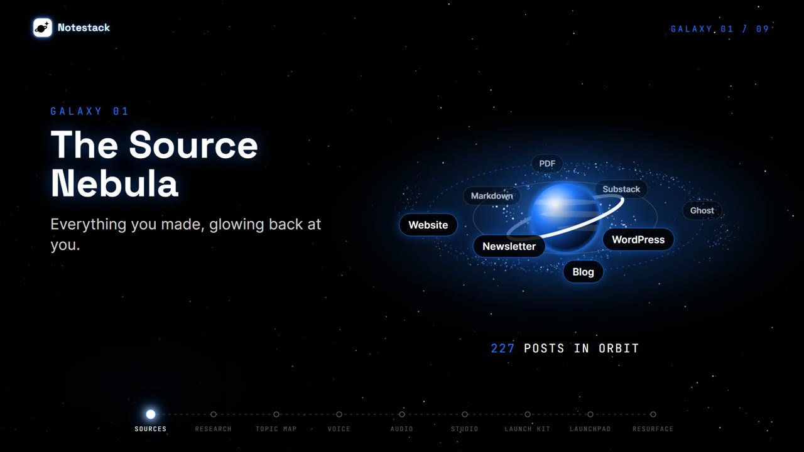

<p align="center">
  <picture>
    <source media="(prefers-color-scheme: dark)" srcset="marketing/logo/notestack-logo.svg">
    
  </picture>
</p>

<h3 align="center">The ultimate NotebookLM alternative for writers, bloggers and newsletters.</h3>

<p align="center">
  Your knowledge, in orbit. <a href="https://notestack.ai">notestack.ai</a>
  · <a href="https://notestack.ai/notebooklm-alternative">Notestack vs NotebookLM</a>
  · <a href="https://notestack.ai/blogs">Blog</a>
</p>

<p align="center">
  <a href="marketing/notestack-launch.mp4">
    
  </a>
  <br>
  <sub>▶ Watch the launch trailer (82 s, sound on) · <a href="https://notestack.ai/demo.mp4">product demo (47 s)</a></sub>
</p>

Notestack turns any blog, newsletter, website or folder of markdown into a grounded research notebook, then into audio
overviews, videos and launch kits, all traced back to the exact lines the writer actually wrote.

- Design doc: [docs/DESIGN.md](docs/DESIGN.md)
- Foundations task list: [docs/PHASE0.md](docs/PHASE0.md)

## Why Notestack instead of NotebookLM

NotebookLM is a great general research notebook. Notestack is built for people who publish: it starts from your whole
archive, stays in sync with it, cites the exact lines behind every answer, and turns what you wrote into things you can ship.

| | Notestack | NotebookLM |
| --- | --- | --- |
| Getting your writing in | Syncs any blog, newsletter or site (Substack, Ghost, WordPress, Medium, RSS, or crawled with Firecrawl), plus md, txt, html and pdf uploads | Add sources one at a time |
| Stays in sync | New posts arrive automatically | Re-add sources by hand |
| Citations | Exact line ranges, verified before you see them | Passage level citations |
| Not in your sources | Says so; unverifiable claims are dropped | Grounded, passage citations |
| Audio | Two hosts on ElevenLabs voices, or your consented voice clone | Two host overviews, Google voices |
| Video | 9:16 shorts, 16:9 explainers, 1:1 audiograms, quote cards | Video overviews |
| Publishing | Launch Kits (threads, LinkedIn, Notes, Bluesky, SEO, carousels) and auto posting | Not a publishing tool |
| Your voice | Voice profile learned from your posts, used in every draft | General purpose writing |
| Seeing your archive | Topic constellation with rising and dormant topics, evergreen resurfacing | Idea Constellations per notebook |

The full comparison lives at [notestack.ai/notebooklm-alternative](https://notestack.ai/notebooklm-alternative).

## Layout

```
backend/    FastAPI + SQLAlchemy + Alembic, Postgres job queue worker, DSPy (LLM agnostic, Z.ai first)
frontend/   React + Vite + TS: night sky landing, pricing, blog, auth, Mission Control
renderer/   Remotion compositions + render service that uploads to R2 via presigned PUT; trailer and demo scripts
marketing/  Launch trailer, poster and logo files
docs/       Design doc and task lists
```

## Run locally

```bash
cp .env.example .env            # fill LLM_API_KEY (Z.ai), GOOGLE_CLIENT_ID, RESEND_API_KEY
docker compose up --build
```

- App: http://localhost:5173, API: http://localhost:8000/docs, MinIO console: http://localhost:9001
- Local storage is MinIO standing in for R2. Presigned URLs point at `http://minio:9000`, so add
  `127.0.0.1 minio` to your hosts file for browser uploads to work locally.
- With `EMAIL_PROVIDER=console`, verification codes print in the `api` logs.

Without Docker (one API process does everything):

```bash
cd backend && python -m venv .venv && .venv/Scripts/pip install -r requirements.txt
alembic upgrade head && uvicorn app.main:app --reload     # SQLite at backend/notestack.db
cd frontend && npm install && npm run dev
cd renderer && npm install && npm start                    # only needed for videos, quote cards, carousels
```

- With `ENV=development` the API runs the job worker in process (`RUN_WORKER_IN_API`), so syncing,
  topic mapping, audio and launch kits work without a second terminal. In production run
  `python -m app.worker` separately and set `RUN_WORKER_IN_API=false`.
- With no R2 settings, files live on local disk under `backend/.storage` and are served through
  signed `/api/storage/local/...` URLs (range requests supported for audio and video seeking).
- Audio needs `ELEVENLABS_API_KEY`; everything text based needs `LLM_API_KEY`.
- Launchpad: posts (text, images, videos from your Library; not audio) go to X and LinkedIn at their
  scheduled time through a `publish_post` job. Set up the developer apps and keys as described in
  `backend/.env.example`:
  - `X_CLIENT_ID` / `X_CLIENT_SECRET`: the X app's **OAuth 2.0 Client ID and Client Secret** (Read and write,
    Web App, callback `{API_URL}/api/social/x/callback`, scopes incl. `media.write`).
  - `LINKEDIN_CLIENT_ID` / `LINKEDIN_CLIENT_SECRET`: products "Sign In with LinkedIn using OpenID Connect" and
    "Share on LinkedIn", redirect `{API_URL}/api/social/linkedin/callback`.
  - `API_URL` must be reachable from the internet for the callbacks (an https tunnel locally).
  X and LinkedIn posts need a connected account. X tokens are refreshed automatically; LinkedIn connections
  last about 60 days. If a connection goes down (expired, revoked on the platform, or disconnected here) its
  scheduled posts are **paused** and never attempted; reconnecting the same account resumes the ones still
  ahead, and missed ones wait for a new time. Bluesky connects with an app password; Substack Notes has no API,
  so those posts arrive as an email reminder at send time.

## What is in the app

| Menu | Does |
| --- | --- |
| Mission Control | Pre-flight checklist, jobs in flight, sources, notebooks, recent launches, upcoming posts |
| Notebooks | Group posts, chat with cited answers (history kept), summaries, audio overviews, videos, quote cards |
| Sources | Connect feeds (Substack archive included), import one URL, upload md/txt/html/pdf, read posts by line |
| Topic map | LLM tagged topics per post, merged into a constellation; make a notebook from any topic |
| Voice profile | Writing voice built from your posts (editable), host voices, consented voice cloning |
| Video and audio | Audio overviews, 9:16 shorts, 16:9 explainers, 1:1 audiograms, quote cards |
| Launch Kit | Hooks, X thread, LinkedIn, Substack Notes, Bluesky, SEO pack, carousel, quote cards, all editable |
| Launchpad | Calendar and agenda, auto posting to X, LinkedIn and Bluesky, email reminders, tracked links, engagement |
| Archive | Every generated artifact with filters, players, downloads, retry and delete |
| Resurfacing | Evergreen scores and reshare angles for old posts, on this day, straight into a kit or the calendar |
| Settings | Profile, workspace, privacy, plan usage meters, connections, sign out everywhere, delete |

## Key choices

| Concern | Where |
| --- | --- |
| Cloudflare R2 storage (keys, presign, uploads) | `backend/app/services/storage.py`, `backend/app/routers/storage.py` |
| Resend email + unsubscribe + campaigns | `backend/app/services/email.py`, `backend/app/worker.py` |
| Google + email code auth, JWT revocation | `backend/app/auth.py`, `backend/app/routers/auth.py` |
| Research over posts as files (no embeddings) | `backend/app/corpus.py`, `backend/app/pipeline/research.py` |
| LLM provider (swap by env) | `backend/app/llm/provider.py`, `.env` `LLM_*` |
| Three plans, billing off | `backend/app/services/plans.py`, `BILLING_ENABLED` |
| Blog posts | `frontend/src/content/blogPosts.ts` (`/blogs`, `/blogs/:slug`) |
| Logo | `frontend/public/logo.svg` (white tile, black ringed planet); lockups in `marketing/logo/` |
| Sky background | `frontend/src/components/SkyCanvas.tsx` |

## Switching LLM providers

```bash
# Z.ai (default). Cheaper: glm-5.3-flash. Free for dev: glm-4.7-flash
LLM_MODEL=openai/glm-5.3  LLM_API_BASE=https://api.z.ai/api/paas/v4  LLM_REASONING_EFFORT=low
# Anthropic
LLM_MODEL=anthropic/claude-sonnet-5  LLM_API_BASE=
# OpenAI
LLM_MODEL=openai/gpt-5  LLM_API_BASE=
```

## Videos and brand

| Asset | File | Rebuild |
| --- | --- | --- |
| Launch trailer (82 s, "Coming soon") | `marketing/notestack-launch.mp4` | `renderer/scripts/make_launch_vo.py`, then `make_launch_music.py`, then `npx remotion render src/index.ts LaunchTrailer ../marketing/notestack-launch.mp4` |
| Landing demo (47 s) | `frontend/public/demo.mp4` | `renderer/scripts/make_demo_vo.py`, then `npx remotion render src/index.ts LandingDemo ../frontend/public/demo.mp4`, then bump `DEMO_VERSION` in `Landing.tsx` |
| Logo | `marketing/logo/` (mark, lockup for dark and light backgrounds) | Mark is `frontend/public/logo.svg`; the renderer uses a copy at `renderer/public/logo.svg` |

Narration is voiced on ElevenLabs (run the scripts from `backend/` with `PYTHONPATH=.`); music is synthesized, no samples.
Preview any composition with `cd renderer && npm run studio`.

## For AI agents

`https://notestack.ai/llms.txt` tells assistants and crawlers what Notestack is, which pages answer which questions, and
what not to index. It is generated on every build from `frontend/seo/sitemap.ts` alongside `sitemap.xml` and `robots.txt`,
so new blog posts appear in all three automatically.

## Roadmap

- [ ] Complete the checkout flow
- [ ] Delete a free tier knowledge base after one week, prompting the writer to upgrade to keep it
- [ ] Onboarding message: the free tier indexes the first 5 posts; upgrade to index the rest
- [ ] An inner "galaxy" view inside the topic map, using a statistical word model to link related pieces of knowledge
- [ ] Make the main app view look good on mobile
- [ ] Explore a whole website through its `llms.txt` and sitemap XML, so every post and page gets included

## Rules

- No em dashes in any UI, email or generated copy. `npm run check:copy` and
  `app/llm/postprocess.py` enforce it.
- Palette is black, `#217cff` and white only.
